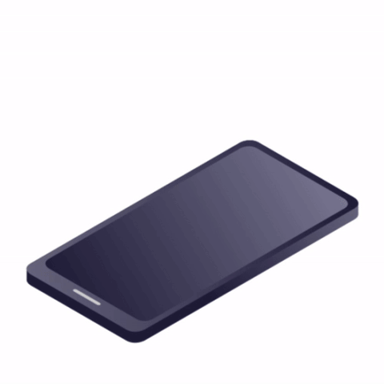
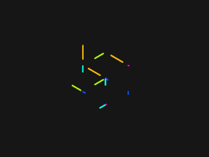

<!--horizontal divider(gradiant)-->

<!--h1 without bottom border-->

  <ul align="left">
    
<h1 style="display: inline-block">Hi there👋, I'm Navillax, also known as Andrés😊</h1>

  </ul>

<!--About Me-->

## 🧑🏻 About me

<picture> </picture>

- 📚 I am a self-taught `Developer` trained at Patrimonio Nacional, Spain.

- 🏆 `2024 IFCD0210` Graduated with a Level 3 Professional Certificate in Web Application Development. `SEPE`

- 💻 **Currently working on** `Frontend Development`, `AI Graphic Design & Generative AI` **&** `Data Analyst`

- 📊 I have knowledge in `Accounting` and `Administration`.

- 💌 Feel free to **reach me out** 

- 😎 `"Life is a sprint"` where you don't always have to be first.

- 🚗 I'm passionate about cars and the automotive world.

 

## 🛠️ My Skills

### <picture>  </picture> Web Development

### <picture>  </picture> Data

 (Code & No-Code with phpmyadmin).

### <picture>  </picture> Software & Tools

### <picture>  </picture> Design

### <picture>  </picture> Others

### <picture>  </picture> AI Management
*Used as a copilot and for content creation*

 

## <picture>  </picture> Github Stats

<!--- stats & Trophy (start) -->

  <!--- stats (start) -->
<table align="left">
<tr border="none">
<td width="40%" align="center">
  
    
   
</td>

<td width="40%" align="center">

  

  </td>
</tr>
</table>

 

<!--profile visit count-->

<!--horizontal divider(gradiant)-->

## 🌐 Connect with me 🤝

---

### 🎧 Spotify Playing 🎧

    

---

Credit: [Navillax](https://github.com/Navillax)

👨🏻‍💻 Developer since 2023, this is my new 

---

Last Edited on: 05 October 2024
